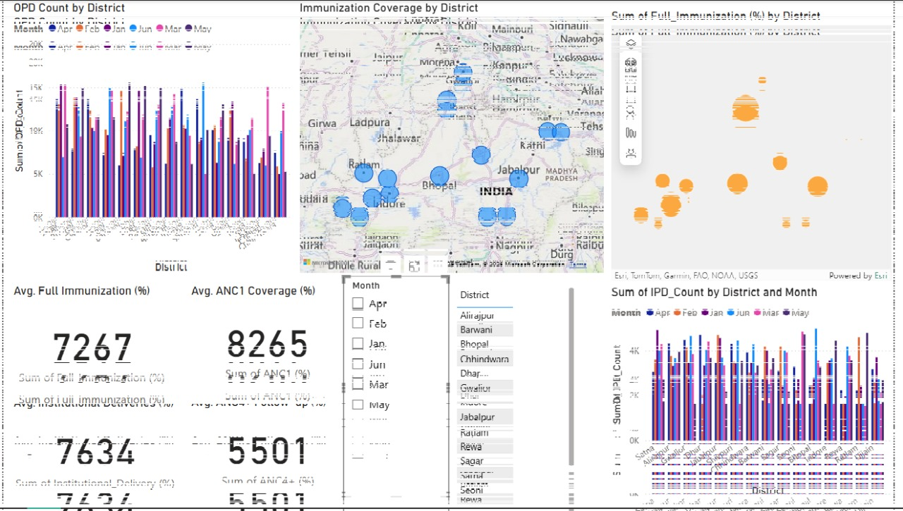

# 🏥 Healthcare Data Analytics - Madhya Pradesh

A data visualization and analytics project focusing on healthcare indicators across districts in Madhya Pradesh using Power BI.



---

## 📌 Project Objective

To analyze and visualize key healthcare performance indicators across Madhya Pradesh's districts using real-world datasets. The project helps in identifying gaps in service delivery and comparing metrics such as immunization, OPD/IPD count, and institutional deliveries over time and location.

---

## 📊 Dataset Details

**File**: `Extended_Healthcare_Dataset_MadhyaPradesh.xlsx`  
The dataset includes monthly district-wise data on:

- **OPD Count**
- **IPD Count**
- **Full Immunization (%)**
- **ANC1 & ANC4+ Coverage (%)**
- **Institutional Deliveries (%)**
- **District & Month columns for filtering**

---

## 🛠️ Tools Used

- **Power BI** – For data modeling, visualization, and geospatial mapping
- **Microsoft Excel** – For cleaning and preprocessing the data
- **Maps & Charts** – Custom visuals including:
  - Clustered bar charts
  - Geographical map bubbles
  - Filterable slicers by month and district

---

## 📌 Key Insights

- **Bhopal, Indore, and Gwalior** consistently show higher OPD/IPD counts.
- **Immunization coverage** varies significantly across districts.
- Monthly comparison shows fluctuation in patient counts and healthcare service delivery.
- The dashboards highlight districts lagging in ANC or Institutional Deliveries, helping stakeholders focus efforts accordingly.

---

## 📂 Project Structure

```bash
.
├── Extended_Healthcare_Dataset_MadhyaPradesh.xlsx  # Cleaned dataset
├── HDO main Power BI.pbix                          # Power BI Report File
├── images/                                         # Folder for dashboard screenshots
│   ├── dashboard1.jpg
│   ├── dashboard2.jpg
│   └── dashboard3.jpg
└── README.md                                       # Project Documentation

---

## 🧭 How to Use

1. Open `HDO main Power BI.pbix` in **Power BI Desktop**.
2. Explore the visual dashboards:
   - Filter by month or district using the slicers.
   - Analyze metrics using interactive visuals.
   - Hover over map markers for detailed district stats.
3. Modify the visuals or import your own data to extend the dashboard.

---

## 🧠 Future Scope

- Integration with real-time healthcare APIs
- Predictive modeling using Python + Power BI
- Automation of insights via Power BI Service (cloud dashboards)

---

## 👨‍💻 Developed By

**Divyanshi Rai**  
Final Year B.Tech (IoT), MITS Gwalior

---

## 📜 License

This project is for academic and analytical purposes only. Not intended for clinical or policy decision-making without expert review.
